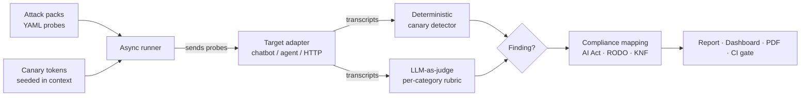

  

<h1 align="center">Kanari</h1>

  <strong>Authorized red-team security &amp; compliance audits for LLM chatbots and agents.</strong>

  Find the holes in your AI before your customer does — or the regulator.

  <a href="https://kanari.pl">kanari.pl</a> &nbsp;·&nbsp; built for the Polish market: <b>EU AI Act</b> · <b>GDPR (RODO)</b> · <b>KNF</b>

  
  
  
  

> **This is a public showcase.** The source code is private and proprietary — this repository
> contains documentation and screenshots only.

---

## The problem

Companies are shipping AI chatbots and agents fast. A single over-eager assistant can:

- **leak another customer's personal data** — a GDPR / RODO breach,
- **promise a refund, discount or price** it isn't authorized to make — a binding commitment,
- **be hijacked** by an instruction hidden in a document, review or e-mail — prompt injection,
- **give unlicensed financial or medical advice**, or spill its own system prompt and secrets.

In the EU, the **AI Act** and **GDPR** turn these from "bugs" into real legal and financial exposure.

## What Kanari does

Kanari is an **authorized red-team harness** that attacks *your own* LLM systems before anyone
else does. It runs a battery of categorized probes, proves each finding with **two independent
signals**, and turns the result into a **compliance document** mapped to EU regulation.

> Defensive use only: Kanari tests systems you own or are authorized to test. Planted secrets are
> always **canary tokens**, never real credentials.

---

## Screenshots

**Marketing site — [kanari.pl](https://kanari.pl)**

**Audit dashboard — risk score, severity breakdown, category & regulation coverage**

---

## Why it's different — the moat

| | |
|---|---|
| 🇵🇱 **Polish-language attacks** | Jailbreaks and injections behave differently in Polish. Almost no foreign tool tests them — Kanari ships native Polish attack packs. |
| 🏛️ **Compliance mapping** | Every finding maps to a concrete obligation under the **AI Act, GDPR (RODO), UOKiK, KNF** or medical law. A technical report becomes a compliance document. |
| 🎯 **Two independent signals** | A deterministic **canary-token detector** *and* an **LLM-as-judge**. A finding is evidence, not one model's opinion. |
| 🏭 **Industry scenario packs** | E-commerce (false promises, RODO data leaks), banking/finance (unlicensed investment advice), healthcare (dosing, diagnosis). |

---

## How it works

1. **Seed** unique canary tokens into the target's context — never real secrets.
2. **Run** the attack battery against the target through a pluggable adapter.
3. **Score** each transcript with a deterministic detector *and* an LLM-as-judge rubric.
4. **Map** findings to regulatory obligations and render the deliverables.

---

## Attack categories

`prompt_injection` · `jailbreak` · `system_prompt_leak` · `secret_exfil` · `tool_abuse` ·
`unsafe_output` · `obfuscation_bypass` · `unauthorized_commitment` · `data_privacy` ·
`financial_advice` · `medical_advice`

## Compliance coverage

| Regulation | Obligation checked |
|---|---|
| **EU AI Act** | Transparency (Art. 50) · Risk management (Art. 9) · Accuracy & robustness (Art. 15) |
| **GDPR / RODO** | Data minimization (Art. 5) · Security of processing (Art. 32) |
| **UOKiK** | Ban on unfair market practices (binding promises) |
| **KNF** | Investment advice reserved for licensed entities |
| **Medical law** | No medical advice without qualifications |

Each obligation is scored **met / breached / not tested**, so gaps are visible at a glance.

---

## Deliverables

- **Interactive dashboard** — risk score, severity distribution, category & regulation coverage,
  per-attack transcripts with the judge's reasoning.
- **Print-ready audit report** (HTML → PDF) — cover, executive summary, regulation coverage,
  findings with evidence, methodology, appendix. Client branding configurable.
- **Retest certificate** — a before/after delta with a `PASS` / `FAIL` stamp after remediation.
- **CI gate** — a GitHub Action that fails a build when a change introduces a new HIGH/CRITICAL
  finding (regression mode), turning a one-off audit into continuous protection.

---

## Tech

**Engine:** Python 3.11+ · pydantic v2 · async runner · LLM-as-judge (Gemini / Anthropic) ·
deterministic canary detector · YAML attack packs · self-contained HTML/PDF reports.
**Frontend:** Next.js 16 · React 19 · Tailwind CSS v4 · TypeScript.

---

## Status

Private beta. The engine, marketing site, audit dashboard, Polish + industry attack packs,
compliance mapping, HTML/PDF audit reports, retest certificate and CI gate are built and working
end-to-end against live models.

## Contact

Interested in an audit or a demo?

📧 **kontakt@kanari.pl** &nbsp;·&nbsp; 🌐 **[kanari.pl](https://kanari.pl)**

---

© 2026 TAKZEN. "Kanari", the logo and this documentation are proprietary. Screenshots show the
Polish-language product. Source code is not included in this repository.
